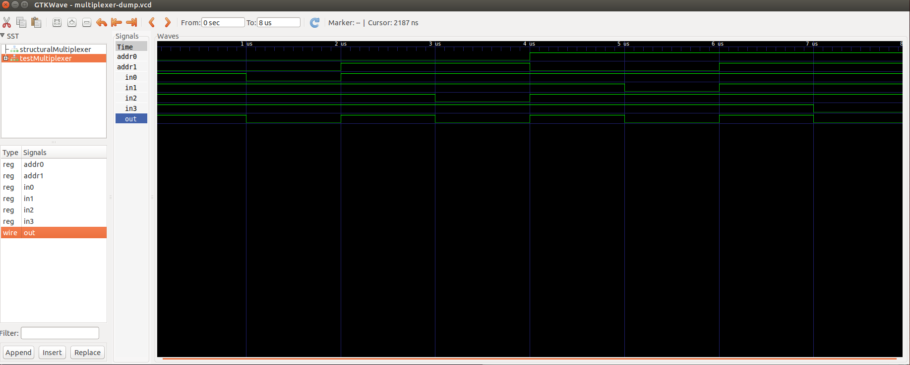
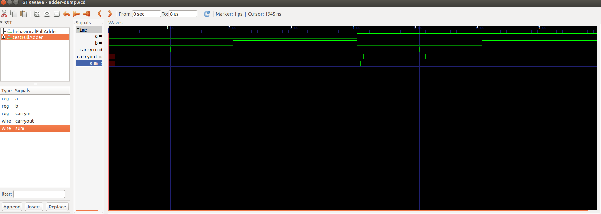
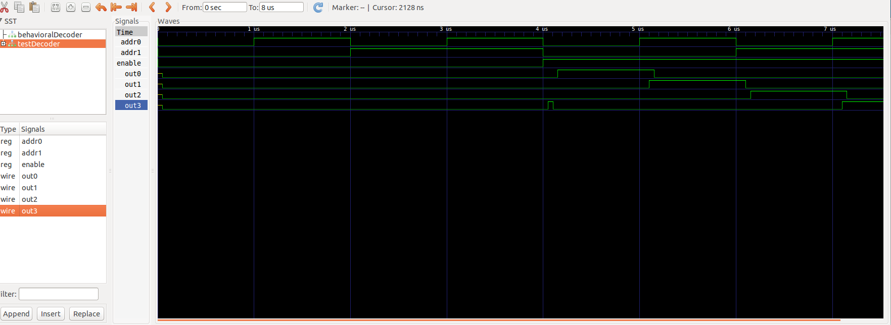

Behavioral Multiplexer

A0 A1 i0 i1 i2 i3 | out
0  0  1  1  1  1  | 1
0  0  0  1  1  1  | 0
0  1  1  1  1  1  | 1
0  1  1  1  0  1  | 0
1  0  1  1  1  1  | 1
1  0  1  0  1  1  | 0
1  1  1  1  1  1  | 1
1  1  1  1  1  0  | 0

Structural Multiplexer

A0 A1 i0 i1 i2 i3 | out
0  0  1  1  1  1  | 1
0  0  0  1  1  1  | 0
0  1  1  1  1  1  | 1
0  1  1  1  0  1  | 0
1  0  1  1  1  1  | 1
1  0  1  0  1  1  | 0
1  1  1  1  1  1  | 1
1  1  1  1  1  0  | 0

Behavioral Adder

A B Cin | Sum Cout
0 0 0   |  0 0
0 0 1   |  1 0
0 1 0   |  1 0
0 1 1   |  0 1
1 0 0   |  1 0
1 0 1   |  0 1
1 1 0   |  0 1
1 1 1   |  1 1

Structural Adder

A B Cin | Sum Cout
0 0 0   |  0 0
0 0 1   |  1 0
0 1 0   |  1 0
0 1 1   |  0 1
1 0 0   |  1 0
1 0 1   |  0 1
1 1 0   |  0 1
1 1 1   |  1 1

Behavioral Decoder

En A0 A1| O0 O1 O2 O3 | Expected Output
0  0  0 |  0  0  0  0 | All false
0  1  0 |  0  0  0  0 | All false
0  0  1 |  0  0  0  0 | All false
0  1  1 |  0  0  0  0 | All false
1  0  0 |  1  0  0  0 | O0 Only
1  1  0 |  0  1  0  0 | O1 Only
1  0  1 |  0  0  1  0 | O2 Only
1  1  1 |  0  0  0  1 | O3 Only

Structural Decoder

En A0 A1| O0 O1 O2 O3 | Expected Output
0  0  0 |  0  0  0  0 | All false
0  1  0 |  0  0  0  0 | All false
0  0  1 |  0  0  0  0 | All false
0  1  1 |  0  0  0  0 | All false
1  0  0 |  1  0  0  0 | O0 Only
1  1  0 |  0  1  0  0 | O1 Only
1  0  1 |  0  0  1  0 | O2 Only
1  1  1 |  0  0  0  1 | O3 Only

